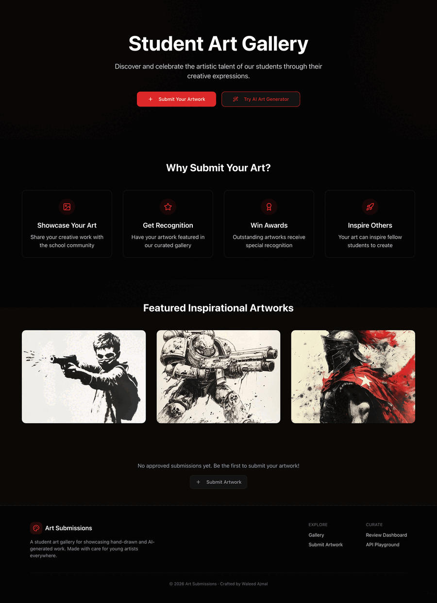
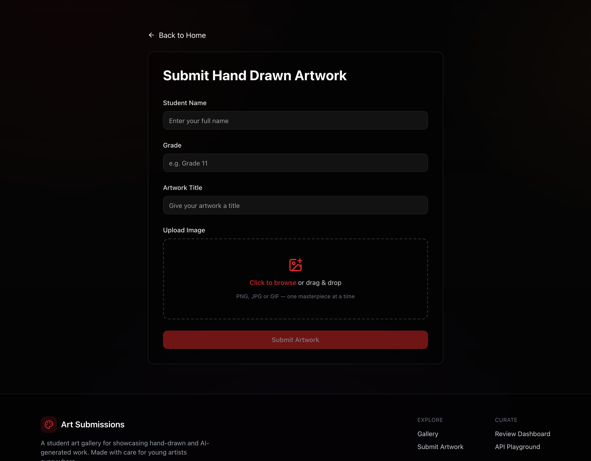
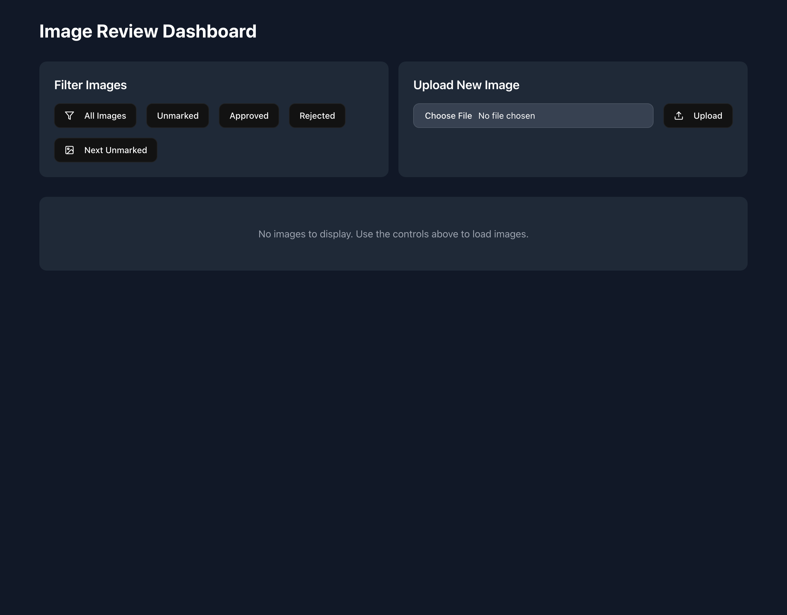
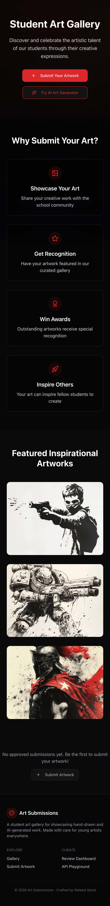
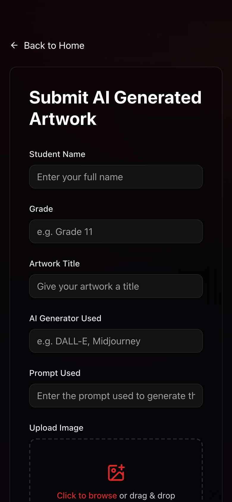
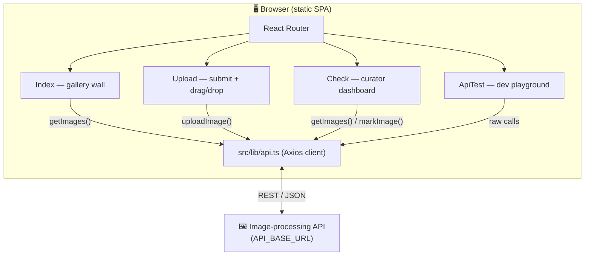

# 🎨 Art Submissions — A Student Art Gallery

> Where young artists hang their work on the wall, get a little famous, and quietly inspire the next kid to pick up a pencil (or a prompt).

<p align="center">
  
  
  
  
  
  
  
</p>

**Art Submissions** is a warm, gallery-style web app for schools and clubs. Students submit their creations — **hand-drawn** or **AI-generated** — and a curator reviews each piece before it goes up on the public wall. It's fast, it's pretty, and it works beautifully on a phone in the back of art class.

<p align="center">
  
  <br />
  <em>Walkthrough demo — replace <code>assets/demo.gif</code> with your own screen recording.</em>
</p>

---

## ✨ What's inside

- **A gorgeous gallery** — hero, curated "why submit" highlights, featured inspiration pieces, and live sections for AI art, hand-drawn art, and competition winners.
- **Two kinds of art, one flow** — pick *AI-generated* or *hand-drawn* and the form adapts. AI submissions capture the generator and prompt so credit stays honest.
- **Drag-and-drop uploads with live preview** — drop an image in, see it instantly, swap it out with one click. No more "wait, did it attach?"
- **A curator dashboard** — review, filter (approved / rejected / unmarked), and approve or reject submissions one tap at a time.
- **An API playground** — a little developer sandbox for poking the backend directly.
- **Mobile-first & buttery** — Framer Motion transitions, a fixed studio-gradient backdrop, and layouts that reflow cleanly from phone to desktop.
- **Graceful when offline** — if the backend is asleep, the gallery shows a friendly empty state instead of a scary blank screen.

|  |  |
|---|---|
|  |  |
| *Submit flow with drag-and-drop + preview* | *Curator review dashboard* |

### Looks great on the little screens too

<p align="center">
  
  &nbsp;&nbsp;
  
</p>

---

## 🧰 Tech stack

| Layer | Tools |
|---|---|
| **Core** | [Vite 5](https://vitejs.dev/) · [React 18](https://react.dev/) · [TypeScript](https://www.typescriptlang.org/) |
| **UI** | [Tailwind CSS](https://tailwindcss.com/) · [shadcn/ui](https://ui.shadcn.com/) (Radix primitives) · [lucide-react](https://lucide.dev/) icons |
| **Motion** | [Framer Motion](https://www.framer.com/motion/) · [Embla Carousel](https://www.embla-carousel.com/) |
| **Data & routing** | [React Router](https://reactrouter.com/) · [Axios](https://axios-http.com/) · [TanStack Query](https://tanstack.com/query) |
| **Forms & validation** | [React Hook Form](https://react-hook-form.com/) · [Zod](https://zod.dev/) |

---

## 🚀 Get it running (beginner-friendly, nothing assumed)

### 1. Prerequisites

You'll need **Node.js 18 or newer** (this app was built and tested on Node 22) and **npm**, which ships with Node.

Check what you have:

```bash
node -v   # should print v18.x or higher
npm -v    # any recent version is fine
```

Don't have Node? Grab it from **[nodejs.org](https://nodejs.org/)**, or if you like living the version-manager life, use **[nvm](https://github.com/nvm-sh/nvm#installing-and-updating)**:

```bash
nvm install 22
nvm use 22
```

### 2. Clone the repo

```bash
git clone https://github.com/waleedsworld/Art-submissions.git
cd Art-submissions
```

### 3. Install the dependencies

```bash
npm install
```

(Grab a coffee — it pulls in the Radix/shadcn family, so the first install takes a moment. ☕)

### 4. Fire up the dev server

```bash
npm run dev
```

Vite will print a local URL (usually **http://localhost:8080**). Open it and you're in the gallery. Edits hot-reload instantly.

### 5. Build for production

```bash
npm run build     # outputs a static site into dist/
npm run preview   # serves the built site locally so you can sanity-check it
```

That `dist/` folder is a plain static bundle — drop it on Cloudflare Pages, Netlify, Vercel, GitHub Pages, or any static host.

### Handy scripts

| Command | What it does |
|---|---|
| `npm run dev` | Start the Vite dev server with hot-reload |
| `npm run build` | Produce an optimized static bundle in `dist/` |
| `npm run build:dev` | Build with source maps / development mode |
| `npm run preview` | Serve the built bundle locally |
| `npm run lint` | Run ESLint across the project |

---

## 🧪 Tests

The project ships with a [Vitest](https://vitest.dev/) suite (jsdom + Testing Library) covering the API client, submission-metadata parsing, and shared UI.

```bash
npm test            # run the suite once
npm run test:watch  # re-run on change while developing
npm run test:coverage
```

Tests live next to the code they exercise as `*.test.ts` / `*.test.tsx` files.

---

## 🔌 The backend

The gallery talks to an image-processing API (upload, list, fetch-by-id, mark-approved) configured in **`src/lib/api.ts`** via `API_BASE_URL`. Point that constant at your own backend to wire up live submissions. The front-end degrades gracefully when the API is unavailable — the gallery simply shows its empty state, so you can develop and demo the UI without a server running.

### Endpoints it expects

| Method | Path | Purpose |
|---|---|---|
| `POST` | `/upload` | Upload a new submission (`multipart/form-data`) |
| `GET` | `/images` | List submissions, optionally `?marking=true\|false\|unmarked` |
| `GET` | `/unmarked` | Fetch the next un-reviewed submission |
| `GET` | `/image/:id` | Fetch a single artwork by id |
| `PUT` | `/mark/:id` | Approve or reject a submission (`{ marking: boolean }`) |

---

## 🏛️ Architecture

A thin, fully static single-page app. Everything the user sees is rendered client-side; the only external dependency is the image API, and the UI stays usable even when that API is unreachable.



### Project map

```
src/
├── pages/
│   ├── Index.tsx      # the gallery home — hero, features, inspiration, live sections
│   ├── Upload.tsx     # submission form with drag-and-drop + live preview
│   ├── Check.tsx      # curator review dashboard
│   ├── ApiTest.tsx    # developer API playground
│   └── NotFound.tsx   # on-brand 404
├── components/
│   ├── Footer.tsx     # shared footer + navigation
│   └── ui/            # shadcn/ui component library
├── hooks/             # use-mobile, use-toast helpers
├── lib/
│   ├── api.ts         # API client (set your base URL here)
│   └── utils.ts       # cn() helper + submission-metadata parsing
└── types/api.ts       # shared TypeScript types
```

---

## 🤝 Contributing

Found a rough edge or have an idea to make the gallery shine brighter? Open an issue or send a PR. Keep it typed, keep it kind, and run `npm run build` before you push so we know it still paints inside the lines. 🖌️

---

## 📄 License

Released under the **[MIT License](LICENSE)**. Do what you like with it — just keep the notice.

---

Crafted with care by **Waleed Ajmal**. Go make something worth hanging on the wall.
